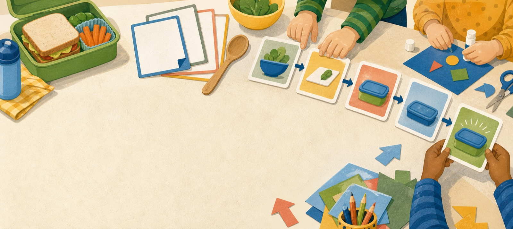
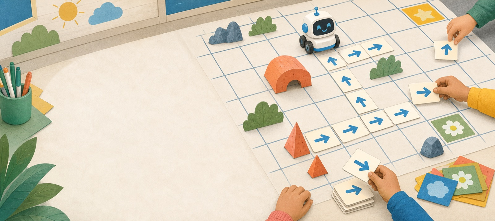
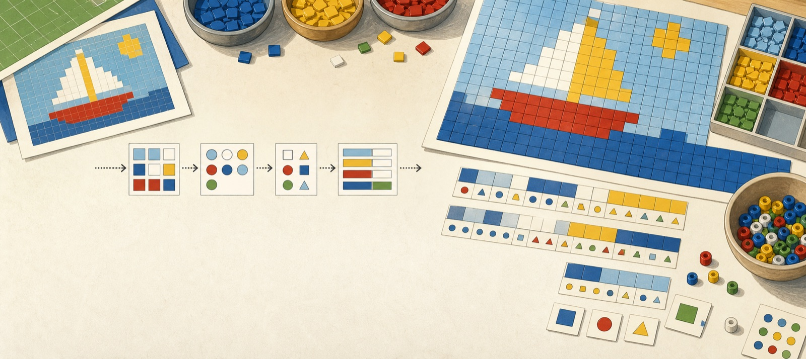
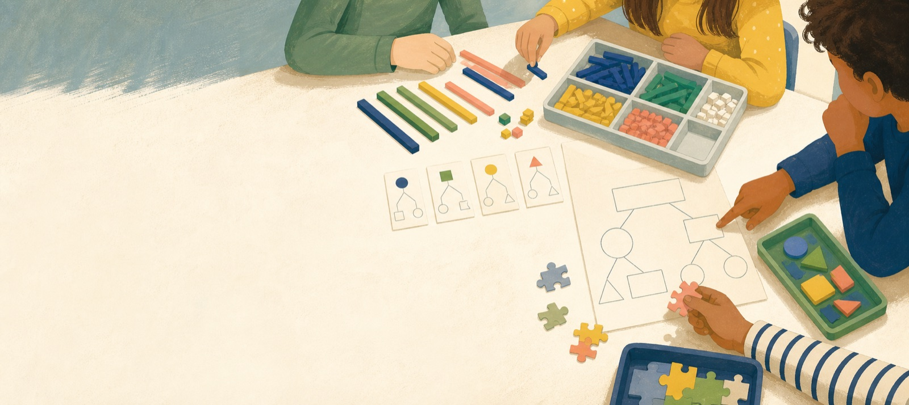

# Contenuti

Il libro è organizzato attorno ad alcuni nuclei di lavoro. Ogni nucleo collega concetti informatici, attività in classe e riflessione didattica.

### Algoritmi quotidiani

Il libro parte da routine familiari per introdurre sequenze di azioni, istruzioni precise e modi diversi di descrivere un procedimento.

### Percorsi e griglie

Le attività su percorsi e griglie aiutano a lavorare su orientamento, sistemi di riferimento, descrizione dei movimenti e controllo delle istruzioni.

### Rappresentare informazioni

Una parte del percorso è dedicata a dati, simboli e rappresentazioni, con esempi vicini alla vita scolastica e adatti al lavoro manipolativo.

### Strategie per problemi

Il libro propone situazioni in cui scomporre un compito, provare strategie, confrontare soluzioni e ragionare sugli errori.

### Programmazione visuale

La programmazione a blocchi viene presentata come ambiente per raccontare, simulare e verificare idee costruite prima in modo concreto.

