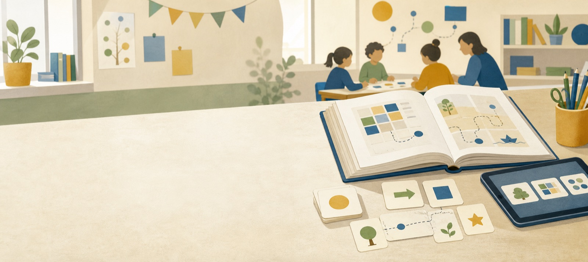
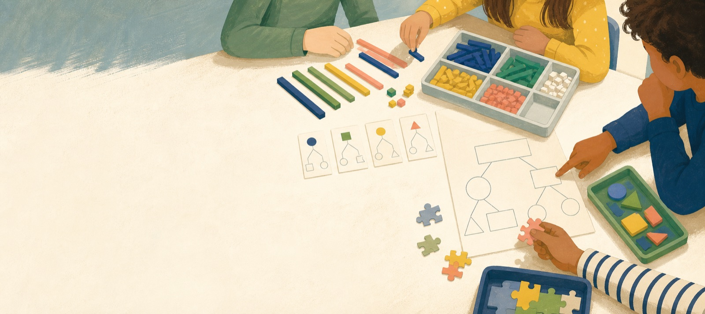

# Insegnare Informatica

*Insegnare Informatica* è una guida per insegnanti del primo ciclo dedicata all'informatica nella scuola.

Il libro nasce originariamente per la scuola primaria, ma è adatto a docenti e studenti di scuola primaria e secondaria di primo grado, anche (e soprattutto) se non hanno basi di Informatica.

{ .wide-image }

## Il libro

Il libro propone un percorso per avvicinare bambine e bambini al pensiero informatico, in linea con le Nuove Indicazioni Nazionali per il primo ciclo.

La guida è disponibile gratuitamente.

<!-- BOOK_DOWNLOADS -->

## Ulteriori risorse

### Formazione video

Percorso di formazione per insegnanti in cui Alberto Montresor e Michael Lodi presentano i contenuti del libro. Liberamente visualizzabile.

[ :material-play-circle: **Guarda la playlist su YouTube**](https://www.youtube.com/playlist?list=PLKu-4ZHSUrc_LzPgufMbVN_hYd86JkSK1){ .video-link rel="noreferrer" }

### Materiali per la classe

[Raccolta di ulteriori materiali per l'insegnamento dell'Informatica nel primo ciclo](https://lodi.ml/infonin/)

## Origine del progetto

Il libro nasce dal lavoro realizzato per [*Sulle orme di Milù* di Mondadori Education](https://www.mondadorieducation.it/catalogo/sulle-orme-di-milu-0074279/), progetto per la scuola primaria che comprende - per quel che riguarda l'Informatica - un **fascicolo studenti** e una **guida docenti**.

Gli autori hanno mantenuto i diritti necessari per pubblicare una versione derivata della guida in questo spazio.

## Autori, licenza e contatti

Autori: Michael Lodi, Agnese Del Zozzo, Alberto Montresor, Giorgia Bissoli

Licenza: [Creative Commons Attribuzione - Non commerciale - Condividi allo stesso modo 4.0 Internazionale](https://creativecommons.org/licenses/by-nc-sa/4.0/deed.it).

Contatti: [michael.lodi@unibo.it](mailto:michael.lodi@unibo.it)

## Idea didattica

L'informatica non è solo uso di dispositivi. È anche un modo per descrivere procedure, rappresentare informazioni, ragionare su problemi e costruire soluzioni comprensibili.

Il percorso privilegia attività concrete, discussione tra pari, confronto delle strategie e collegamenti con le discipline già presenti nella scuola.

## Contenuti

Il libro attraversa cinque nuclei: algoritmi quotidiani, percorsi e griglie, rappresentazione delle informazioni, strategie per risolvere problemi e programmazione visuale.

[Vai ai contenuti](contenuti.md)

## A chi è rivolto

Il sito è pensato per insegnanti della scuola che desiderano proporre informatica in modo graduale, accessibile e collegato alle esperienze quotidiane degli alunni.
